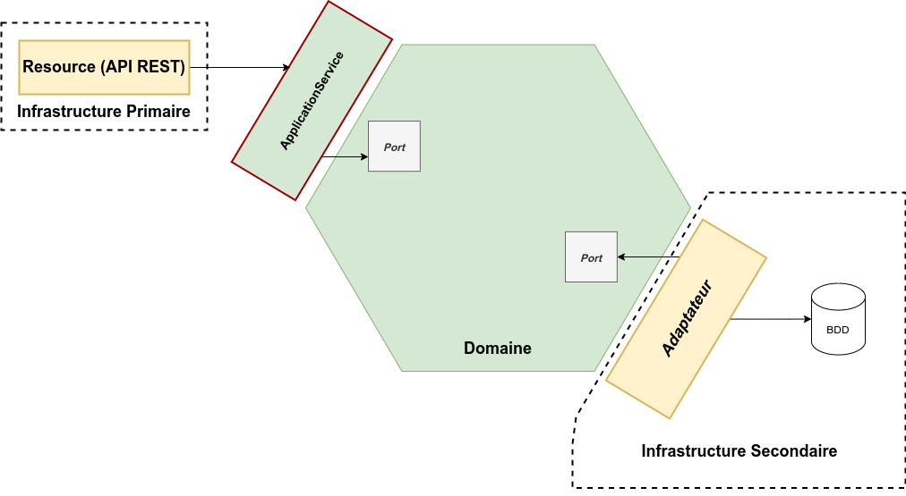
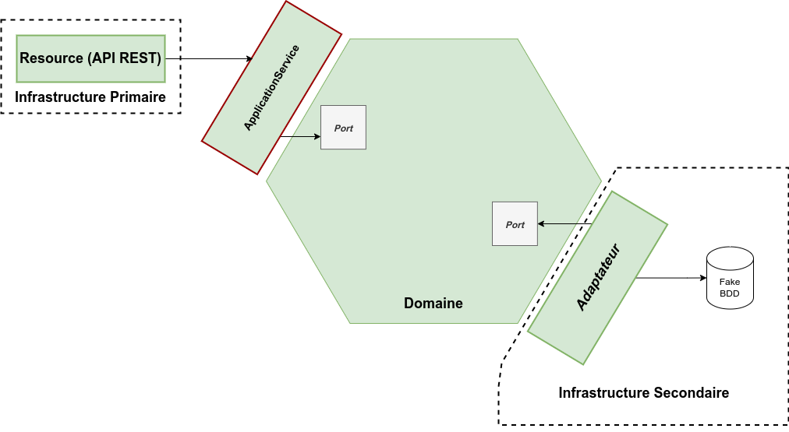

> Image d'illustration : Copyright 42skillz / Thomas PIERRAIN

## Le besoin

Développer de bons tests unitaires n'est pas une tâche aisée. Même les développeurs les plus expérimentés peuvent tomber dans les pièges "classiques" de la pratique du développement des tests automatisés.

Les plus courants sont :
* **Les tests fragiles** : ce qu'on teste dans ceux-ci est souvent l'implémentation. Ces tests utilisent largement les mocks. Lors d'un refactoring, ils devront être mis à jour systématiquement, et ce sera coûteux.
* **Les tests "inutiles"** : ce sont des tests qui testent du code trivial, et qui n'apportent pas de plus value au projet. Ce sont des tests qui ne sont pas orientés métier. Par exemple : un test qui va tester une classe de mapping.
* **Les tests trop complexes** : ceux-ci sont souvent des tests d'intégration qui nécessitent beaucoup de plomberie (liée au prérequis) que l'on ne voit pas. De ce fait, ils deviennent rapidement très difficiles à maintenir. Ils sont souvent trop longs en termes de code et de temps d'exécution.

Mais alors, comment peut-on réaliser des tests plus robustes ? Pour cela, laissez-moi vous présenter l'**Outside-in Diamond TDD**.

## Qu'est ce que l'Outside-in Diamond TDD ?

L'Outside-in Diamond TDD est une technique d'approche des tests unitaires mise au point par [**Thomas Pierrain**](http://tpierrain.blogspot.com/).

L'idée de base est née d'une constatation : la notion de tests unitaires est mal comprise par la majorité des développeurs. En effet, ceux-ci pensent qu'un test unitaire est un bout de code qui va tester un petit composant en isolation des autres. Or, comme le fait si bien remarquer Thomas Pierrain, la définition de [**Kent Beck**](https://fr.wikipedia.org/wiki/Kent_Beck) est beaucoup plus juste :

> “Tests that “runs in isolation” from other tests”

Un bon test unitaire s'isole donc lui-même, et non pas le système qu'il teste. Cela veut dire que l'on peut faire des tests unitaires qui ne testent pas qu'une classe.

De plus, Thomas Pierrain a constaté que la [**pyramide des tests**](https://martinfowler.com/bliki/TestPyramid.html) est souvent utilisée de manière dogmatique sans que les développeurs ne se posent la question de ce qui est pertinent à tester.

Thomas Pierrain a cherché pendant longtemps à lutter pour faire oublier ces fausses idées, sans succès. J'aime bien sa référence à la loi d'[**Alberto Brandolini**](https://fr.wikipedia.org/wiki/Loi_de_Brandolini) à propos de ce sujet :

> “The amount of energy needed to refute bullshit is an order of magnitude larger than to produce it”

Donc plutôt que de lutter inutilement pour faire admettre ces idées, Thomas Pierrain est parti sur l'idée de promouvoir les [**tests d'acceptation**](https://fr.wikipedia.org/wiki/Test_d%27acceptation). En effet, ceux-ci sont plus faciles à faire accepter pour voir le système à tester comme une boîte noire, et donc les développeurs auront alors plûtot tendance à tester en termes de contrat métier, ce qui est plus sain pour la maintenabilité des projets.

#### Outside-in

La notion d'**Outside-in TDD** est assez simple à comprendre : on teste de l'extérieur en allant vers l'intérieur. 

On commence donc par écrire des **tests d'acceptation** "gros grain" qui sont orientés métier et testent le système en boîte noire. Pendant la phase red de TDD portant sur ces tests gros grain, on peut être amené à réaliser des boucles TDD plus petites sur l'intérieur du système, typiquement sur le modèle du domaine. A la fin, une fois toutes ces petites boucles réalisées, la boucle principale "gros grain" deviendra alors passante.

#### Diamond

La notion de **Diamond** vient du fait que les tests réalisés changent complètement la pyramide de test telle que nous la connaissons.

Le diamant est fait pour symboliser l'importance et la prépondérance de ces tests d'acceptation par rapport aux autres types de tests (cf. image en haut de l'article) : tests unitaires, tests d'intégration, tests end-to-end.

Ce style de TDD nous oriente donc à écrire plus de tests haut niveau et moins de tests dans le détail.

## Pourquoi l'Outside-in Diamond TDD est si intéressant ?

Cela fait quelques années maintenant que j'utilise l'[**architecture hexagonale**](https://fr.wikipedia.org/wiki/Architecture_hexagonale_(logiciel)) dans mes projets en production. J'ai toujours privilégié les tests unitaires au niveau de mon modèle de domaine, en les construisant à partir des différents cas manipulés par mes _ApplicationService_.

Le schéma ci-dessous représente **en vert la partie couverte** par les tests unitaires tels que je les réalisais :

**Cela pose un problème majeur**. Il y a tout une partie de code qui se retrouve non testée : les adaptateurs de gauche (API REST par exemple), et les adaptateurs de droite (base de données par exemple). Ces parties sont matérialisées en jaune sur le schéma. Bien sûr, ils étaient couverts par les tests d'intégration, mais les tests d'intégration sont <u>lents</u>.

Thomas Pierrain nous fait le retour d'expérience suivant : la plupart des bugs subtils proviennent de ce code non testé, présent dans les adaptateurs. Il préconise donc de tester **<u>tout l'hexagone</u>**, en partant des adaptateurs de gauche, ainsi qu'en incluant les adaptateurs de droite (en mockant ou fakant uniquement les I/O, que ce soit de la base de données, du fichier ou du réseau).

C'est là tout l'intérêt de ce pattern de tests : on a des tests à la fois **rapides** et qui couvrent **largement** notre base de code.

On a alors un code couvert comme cela :

Voyons maintenant un exemple de code pour ces tests (gestion de panier sur un site de e-commerce) :



## Conclusion

Finalement, qu'est ce que c'est qu'un _"bon"_ test unitaire ? Si on interroge des développeurs différents, on aura sûrement des définitions différentes.

Pour moi, un bon test unitaire est un test qui va **tester un contrat métier**, sans se préoccuper de l'implémentation. De cette manière, il pourra survivre à tous les refactorings.

Mais ce n'est pas tout. Un bon test unitaire doit être **parlant**. Il doit être **concis**. Malheureusement, le code des tests unitaires est souvent considéré comme moins important que le code de prod, et c'est une erreur. Il faut qu'il soit traité avec la plus grande attention. Je vais même aller plus loin : si un test est bien écrit, il est la documentation de votre usecase que vous n'écrirez jamais.

Personnellement, j'aime bien l'approche proposée par [**Vladimir Khorikov**](https://techleadjournal.dev/episodes/58/) pour définir la valeur d'un test. Pour lui, les 4 piliers fondamentaux d'un bon test sont :

* qu'il doit permettre d'intercepter une régression
* qu'il doit résister aux refactorings (grâce au fait qu'il ne soit pas lié à l'implémentation du système testé)
* qu'il doit fournir un feedback très rapide
* qu'il doit avoir un coût de maintenance faible

Je trouve que les tests réalisés en Outside-in Diamond TDD remplissent très bien ces fonctions :

* ils interceptent bien les régressions car ce sont des tests d'acceptation orientés métier qui testent du comportement. Si celui-ci change, alors on le sait immédiatement.
* ils résistent au refactoring car on teste en boîte noire l'hexagone complet en partant des adaptateurs de gauche
* ils sont rapides, car on utilise le moins de frameworks possible et on mock les I/O (BDD, file system, réseau, ...)
* ils ont un coût de maintenance faible de par leur nature "métier"

Un autre avantage indéniable que je trouve dans ce pattern de TDD : il permet d'écrire **moins de tests**, et **mieux**.

Chez **Primobox**, nous mettons en place ce pattern de tests afin de pérenniser nos projets sur le long terme.

**_Sources :_**
* [Outside-in Diamond 🔷 TDD #1 - a style made from (& for) ordinary people](http://tpierrain.blogspot.com/2021/03/outside-in-diamond-tdd-1-style-made.html)
* [Outside-in Diamond 🔷 TDD #2 (anatomy of a style)](http://tpierrain.blogspot.com/2021/03/outside-in-diamond-tdd-2-anatomy-of.html)
* [Tech Lead Journal #58 - Principles for Writing Valuable Unit Tests - Vladimir Khorikov](https://techleadjournal.dev/episodes/58/)